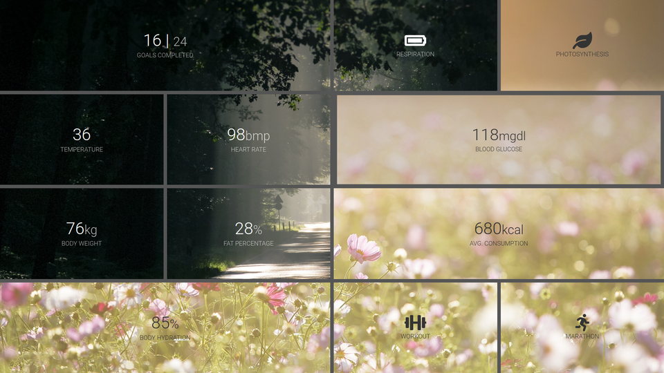

## About

Small experiment with background image shared between different divs using only css. CSS Grid is used for grid structure. Inspired by [Multiple.js ](https://multiple.js.org/).



Effect is achieved by

```css
background-attachment: fixed;
```

Used images are from [Pexels](https://www.pexels.com/).
